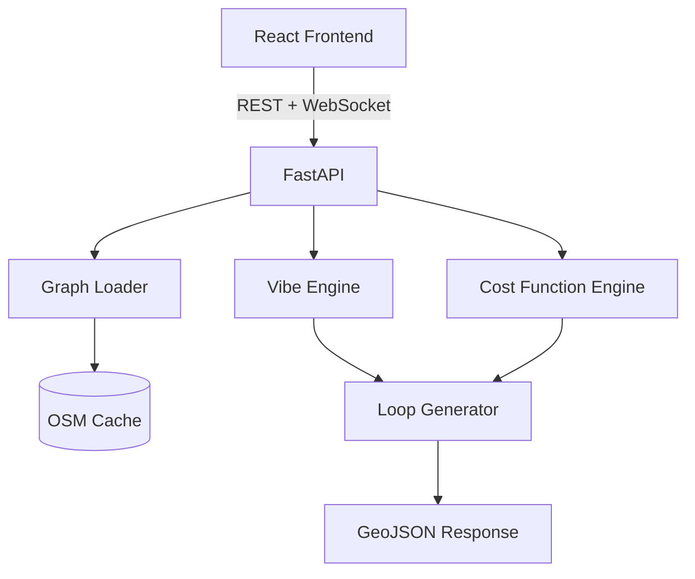

# GeoStride

[](./LICENSE)
[](https://python.org)
[](https://typescriptlang.org)

A generative walking route planner that creates optimized, circular routes on OpenStreetMap based on your vibe preferences (greenery, quietness, safety, and more).

## Architecture



## Quick Start

```bash
git clone https://github.com/yourusername/geostride.git
cd geostride
cp backend/.env.example backend/.env
cp frontend/.env.example frontend/.env
docker compose up --build
```

Open `http://localhost:5173`, click the map to set a starting point, adjust vibe sliders, and generate a route.

### Without Docker

**Backend:**
```bash
cd backend
python -m venv .venv && source .venv/bin/activate
pip install -e ".[dev]"
uvicorn geostride.main:app --reload
```

**Frontend:**
```bash
cd frontend
npm install
npm run dev
```

### CLI

```bash
pip install -e ".[dev]"
geostride --lat 40.7812 --lon -73.9665 --duration 30 --greenery 0.9
```

## Configuration

### Backend

| Variable | Description | Default |
|----------|-------------|---------|
| `HOST` | Server bind host | `0.0.0.0` |
| `PORT` | Server bind port | `8000` |
| `DEBUG` | Debug mode (verbose logging, reload) | `False` |
| `LLM_PROVIDER` | LLM backend (openai, anthropic, local) | `openai` |
| `LLM_MODEL` | Model ID for LLM provider | `gpt-4o-mini` |
| `LLM_API_KEY` | API key for LLM provider | — |
| `LLM_BASE_URL` | Custom LLM endpoint (e.g. local model) | — |
| `SESSION_TTL_SECONDS` | Session expiry in seconds | `3600` |
| `CACHE_DIR` | OSM graph cache directory | `./data/cache` |
| `WALKING_SPEED_KMH` | Assumed walking speed | `4.5` |

### Frontend

| Variable | Description | Default |
|----------|-------------|---------|
| `VITE_API_URL` | Backend API URL | `http://localhost:8000` |

## API Reference

| Method | Path | Description |
|--------|------|-------------|
| `GET` | `/health` | Health check with OSM connectivity status |
| `GET` | `/cached-regions` | List cached graph regions |
| `POST` | `/set-location` | Store map pin coordinates in session |
| `GET` | `/get-route/{session_id}` | Retrieve a generated route |
| `POST` | `/execute` | Generate a circular walking route |
| `WS` | `/ws/{session_id}` | Real-time route delivery channel |

### POST `/execute`

```json
{
  "origin": { "lat": 40.7812, "lon": -73.9665 },
  "duration_minutes": 30,
  "vibes": {
    "greenery": 0.9,
    "blue_space": 0.0,
    "introvert_mode": 0.3,
    "extrovert_mode": 0.0,
    "safety_check": 0.7,
    "walkability": 0.5
  }
}
```

## How the Generative Cost Function Works

Traditional routing finds the shortest path by distance. GeoStride applies a **Generative Cost Function** to each road segment:

```
Cg = C_base * (1 - Quality_Score * Smoothing_Factor)
```

The Vibe Engine scores each road segment across six dimensions (greenery, blue space, quietness, liveliness, safety, walkability) by analyzing nearby OpenStreetMap POIs. When a segment matches your vibe preferences, its Quality Score rises, its effective cost drops, and the pathfinder is naturally drawn toward it.

## Contributing

1. Fork the repo and create a feature branch
2. Use [conventional commits](https://www.conventionalcommits.org/)
3. Run `pre-commit install` to set up hooks
4. All CI checks must pass: `ruff`, `pyright`, `eslint`, `tsc`, `pytest`, `vitest`
5. Target 70%+ test coverage for new code

## License

MIT — see [LICENSE](./LICENSE).
